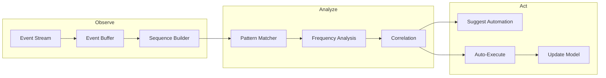
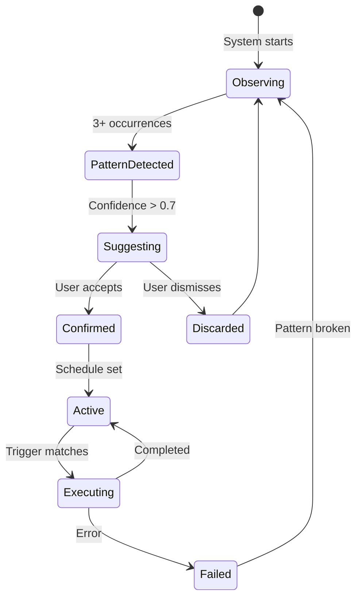

# Automation Engine

The Automation Engine observes user behavior over time, detects recurring patterns, and autonomously executes learned workflows.

## Pattern Detection Pipeline



## Event Types

The engine tracks these user events:

| Event | Trigger | Example |
|-------|---------|---------|
| `AppLaunched` | Application started | `Firefox` |
| `FileOpened` | File accessed | `/docs/report.md` |
| `CommandRun` | Terminal command | `git push` |
| `WindowFocus` | Window changed | `Code - main.rs` |
| `WorkspaceSwitch` | Workspace changed | Workspace 3 |
| `NetworkJoin` | WiFi connected | `Office-Network` |
| `DevicePlugged` | USB/HDMI connected | External monitor |

## Pattern Types

### Sequential Patterns

```json
{
  "type": "sequential",
  "events": [
    "AppLaunched: Terminal",
    "CommandRun: cd projects/my-app",
    "CommandRun: npm run dev"
  ],
  "frequency": 15,
  "time_window_minutes": 2,
  "confidence": 0.92
}
```

### Conditional Patterns

```json
{
  "type": "conditional",
  "trigger": "NetworkJoin: Office-Network",
  "then": [
    "AppLaunched: Slack",
    "AppLaunched: Firefox",
    "SetWorkspace: 1: Communication"
  ],
  "invocations": 87,
  "confidence": 0.98
}
```

### Temporal Patterns

```json
{
  "type": "temporal",
  "schedule": "weekday 09:00",
  "actions": [
    "OpenCalendar",
    "ShowWeather",
    "StartFocusMode"
  ],
  "invocations": 42,
  "confidence": 0.85
}
```

## Automation Lifecycle



## Suggested Automation UI

When the engine detects a pattern, it surfaces a suggestion:

```
┌─────────────────────────────────────────┐
│  🔄 Automation Detected                  │
│                                         │
│  I notice you always open Slack,        │
│  Firefox, and VS Code when you join     │
│  your office network.                   │
│                                         │
│  Auto-run this when connecting to       │
│  "Office-Network"?                      │
│                                         │
│  [Yes, Save] [Run Once] [Not Now]       │
└─────────────────────────────────────────┘
```

## Configuration

```toml
[automation]
enabled = true
learning_rate = 0.1
min_observations = 3
confidence_threshold = 0.7
auto_execute = false
max_suggestions_per_day = 5
time_window_minutes = 5
event_buffer_size = 10000
```

## Next Steps

- [Planner](planner.md) — Multi-step task decomposition
- [Knowledge Graph](graph.md) — Entity relationships
- [Reasoning Engine](reasoning.md) — Core logic processing
