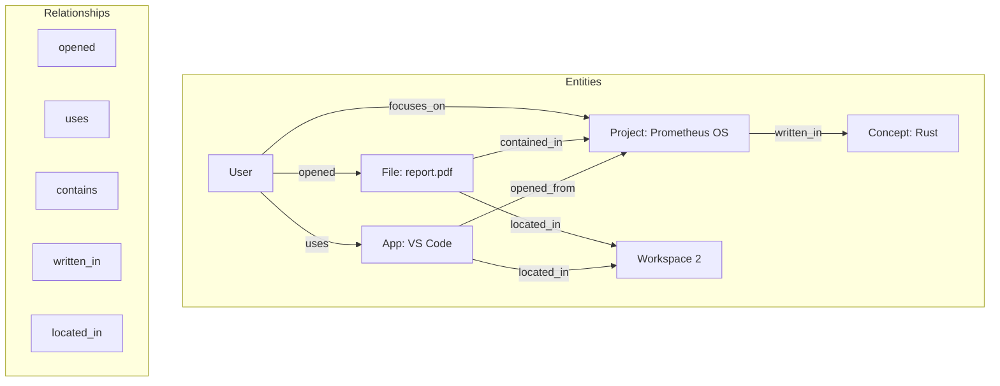
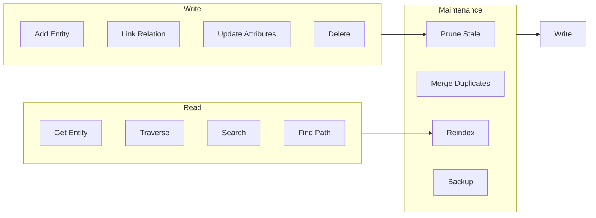

# Knowledge Graph

The Knowledge Graph is a semantic network that stores entities (people, files, applications, concepts) and their relationships. It enables the AI to understand connections, infer context, and answer complex relational queries.

## Graph Structure



## Node Types

```rust
pub enum EntityType {
    User,
    Application,
    File(DocumentType),
    Project,
    Workspace,
    Device,
    Network,
    Concept,
    Task,
    Preference,
    Event,
}

pub enum RelationshipKind {
    Uses,
    Contains,
    LocatedIn,
    Precedes,
    DependsOn,
    SimilarTo,
    PartOf,
    Created,
    Modified,
    Accessed,
    OwnedBy,
    RelatedTo,
}
```

## Query Examples

```rust
// What's on workspace 2?
let workspace = graph.get_entity("workspace_2")?;
let contents = graph.traverse(workspace.id, RelationshipKind::LocatedIn)?;

// What project is most related to Rust?
let rust = graph.search("Rust", EntityType::Concept)?;
let related = graph.find_path(rust.id, EntityType::Project, 2)?;

// What have I been working on recently?
let recent = graph.query()
    .entity_type(EntityType::File)
    .relationship(RelationshipKind::Accessed)
    .time_range(24.hours())
    .limit(10)
    .execute()?;
```

## Graph Operations



## Performance

| Operation | Latency p50 | Latency p99 |
|-----------|-------------|-------------|
| Entity lookup | 0.1 ms | 0.5 ms |
| Relationship insert | 0.3 ms | 1.2 ms |
| 1-hop traversal | 0.5 ms | 2.0 ms |
| 3-hop traversal | 2.0 ms | 8.0 ms |
| Full-text search | 1.0 ms | 5.0 ms |
| Semantic search | 3.0 ms | 15.0 ms |

## Configuration

```toml
[graph]
base_path = "/var/lib/prometheus/graph"
max_nodes = 100000
max_edges = 500000
auto_persist_interval_sec = 30
enable_wal = true
index_distance = "cosine"
vector_dimension = 768
```

## Next Steps

- [Memory System](memory.md) — Memory types and persistence
- [Automation Engine](automation.md) — Pattern detection from graph
- [Reasoning Engine](reasoning.md) — Graph-enhanced reasoning
