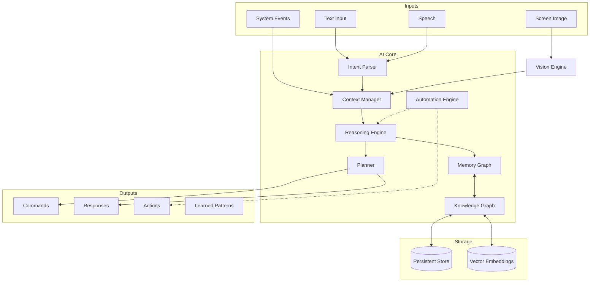
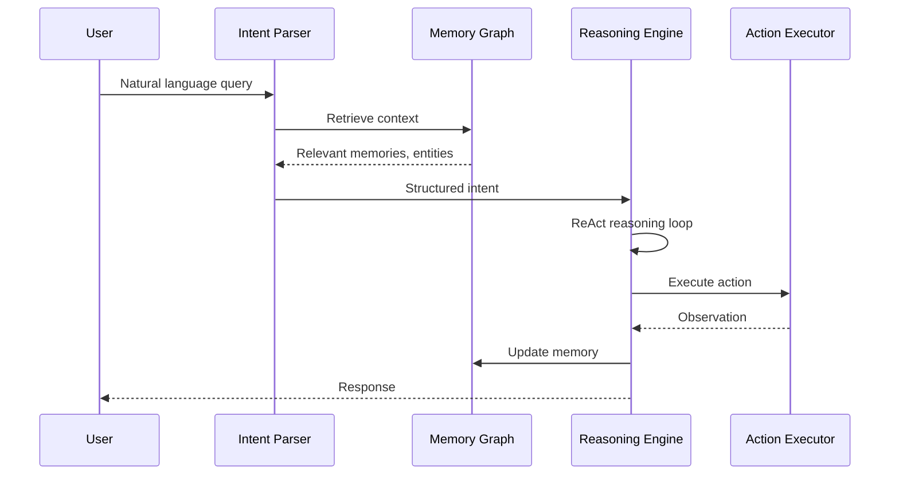
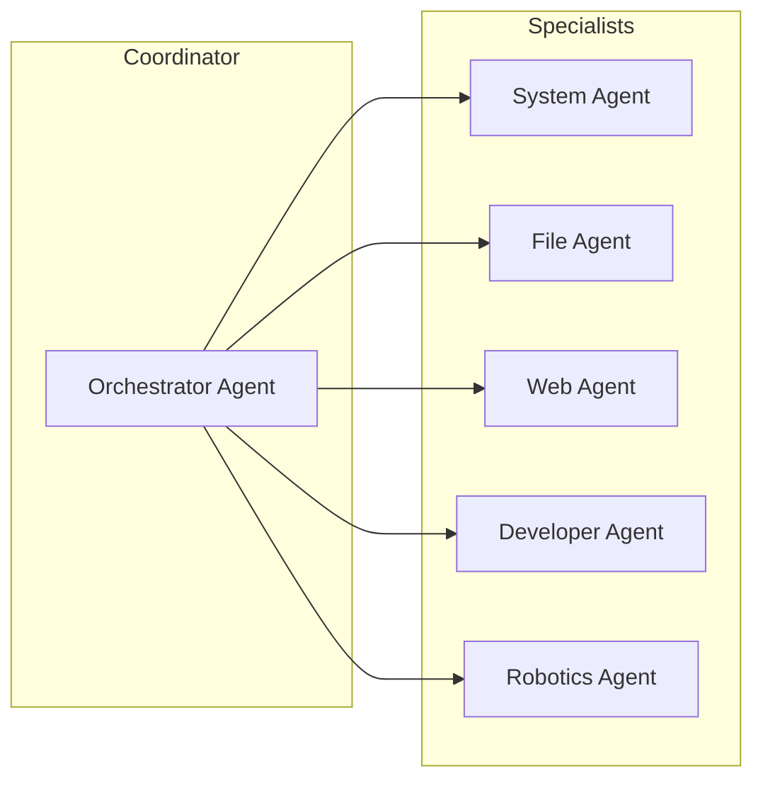

# AI Core

The AI Core is the central nervous system of Prometheus OS. It processes user intent, maintains context, executes actions, and continuously learns from outcomes. It is not an application — it is the operating environment itself.

## Architecture



## Pipeline



## Core Capabilities

### Intent Parsing

Converts raw natural language into structured, machine-readable commands. Supports:

- **Direct commands:** "Open terminal" → `Action { target: Terminal, verb: Launch }`
- **Queries:** "What's using my RAM?" → `Action { target: SystemMonitor, verb: Query }`
- **Compound requests:** "Find my project files and open them in the editor"
- **Ambiguous resolution:** "Turn it up" → resolves "it" to the active audio context

### Context Management

Maintains a window of current state:

- Active workspace and application
- Recently viewed files and documents
- Current user task and focus
- System state (CPU, memory, network)
- Active conversations and their history

### Multi-Agent Orchestration

Complex tasks are decomposed across specialized agents:



## Performance Characteristics

| Metric | Target | Current |
|--------|--------|---------|
| Intent parsing | < 10 ms | ~3 ms |
| Context retrieval | < 5 ms | ~2 ms |
| Reasoning (simple) | < 50 ms | ~25 ms |
| Reasoning (complex) | < 200 ms | ~120 ms |
| Memory write | < 1 ms | ~0.3 ms |
| Memory search | < 5 ms | ~2 ms |

## Configuration

Configuration is managed through `/etc/prometheus/ai.conf`:

```toml
[core]
model_path = "/usr/lib/prometheus/models"
context_window = 4096
max_agents = 4

[memory]
graph_db_path = "/var/lib/prometheus/memory"
vector_dimension = 768
auto_prune = true
prune_threshold_days = 90

[voice]
enabled = true
wake_word = "prometheus"
stt_model = "whisper-base"
tts_model = "voice-engine"

[vision]
enabled = true
capture_fps = 5
ocr_engine = "tesseract"
```

## Next Steps

- [Reasoning Engine](reasoning.md) — ReAct chain-of-thought processing
- [Memory System](memory.md) — Persistent knowledge graph
- [Knowledge Graph](graph.md) — Semantic entity relationships
- [Vision Engine](vision.md) — Screen understanding and OCR
- [Voice Engine](voice.md) — Speech recognition and synthesis
- [Automation Engine](automation.md) — Workflow learning and execution
