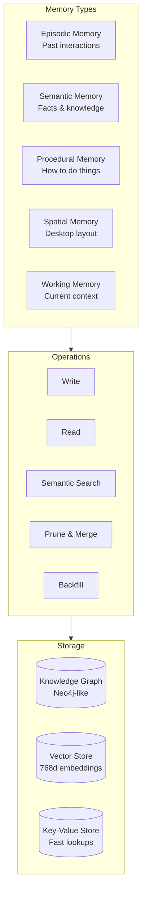
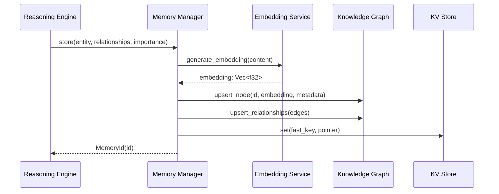

# Memory System

The Memory System is a persistent, semantic knowledge base that stores entities, relationships, and experiences across sessions. It enables the AI to remember users, preferences, past interactions, and learned patterns.

## Architecture



## Memory Structure

```rust
pub struct MemoryNode {
    pub id: Uuid,
    pub node_type: NodeType,
    pub content: String,
    pub embedding: Vec<f32>,
    pub timestamp: DateTime<Utc>,
    pub access_count: u64,
    pub last_accessed: DateTime<Utc>,
    pub importance: f32,
    pub ttl: Option<Duration>,
}

pub enum NodeType {
    Entity(String),       // Person, file, app, etc.
    Concept(String),      // Abstract idea or category
    Event(String),        // Past interaction
    Task(String),         // User task or goal
    Preference(String),   // User setting or habit
    Relationship { from: Uuid, to: Uuid, kind: String },
}
```

## Memory Operations

### Write Pathway



### Semantic Search

```rust
impl MemoryGraph {
    /// Find memories semantically similar to the query
    pub fn search(&self, query: &str, limit: usize) -> Vec<MemoryNode> {
        let query_embedding = self.embed(query);
        // Cosine similarity search over all nodes
        let candidates: Vec<_> = self.nodes.iter()
            .map(|(_, node)| {
                let similarity = cosine_similarity(&query_embedding, &node.embedding);
                (node, similarity)
            })
            .collect();
        candidates.sort_by(|a, b| b.1.partial_cmp(&a.1).unwrap());
        candidates.into_iter()
            .take(limit)
            .map(|(node, _)| node.clone())
            .collect()
    }
}
```

## Memory Types

### Episodic Memory

Stores past interactions as discrete episodes:

```json
{
  "type": "episode",
  "timestamp": "2026-07-23T14:30:00Z",
  "content": "User compiled kernel with custom scheduler",
  "context": { "workspace": 2, "duration_sec": 45 },
  "outcome": "success",
  "importance": 0.7
}
```

### Semantic Memory

Factual knowledge about the world and system:

```json
{
  "type": "fact",
  "subject": "user_preferred_browser",
  "object": "Firefox",
  "confidence": 0.95,
  "source": "observed_behavior"
}
```

### Procedural Memory

Sequences of actions that achieve specific goals:

```json
{
  "type": "procedure",
  "name": "setup_web_project",
  "steps": [
    "mkdir projects/web-app",
    "cd projects/web-app && npm init",
    "code ."
  ],
  "trigger": "user said 'new web project'",
  "invocations": 12
}
```

## Pruning & Maintenance

The memory graph automatically prunes low-importance, old entries:

```rust
pub struct PruneConfig {
    pub max_nodes: usize,             // 100,000
    pub max_edges: usize,             // 500,000
    pub importance_threshold: f32,    // 0.1
    pub max_age_days: u64,            // 90
    pub run_interval_minutes: u64,    // 60
}
```

## Persistence

| Storage | Technology | Purpose |
|---------|-----------|---------|
| Knowledge Graph | Custom DashMap + BTreeMap | In-memory graph with persistence |
| Vector Store | Custom HNSW | Approximate nearest neighbor search |
| Fast Cache | HashMap + LRU | Frequently accessed items |
| WAL | Append-only log | Crash recovery |

## Next Steps

- [Knowledge Graph](graph.md) — Entity relationships and traversal
- [Automation Engine](automation.md) — Pattern learning from memory
- [Configuration](config.md) — Memory tuning parameters
