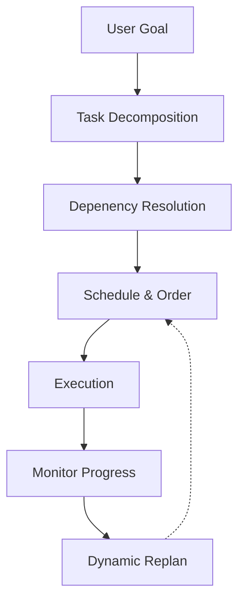
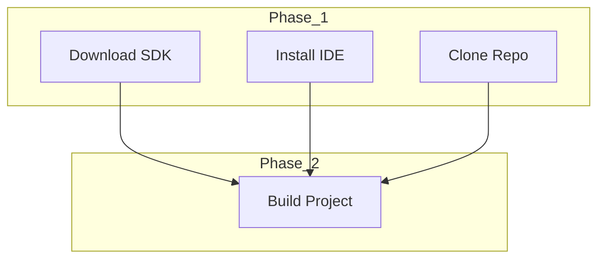
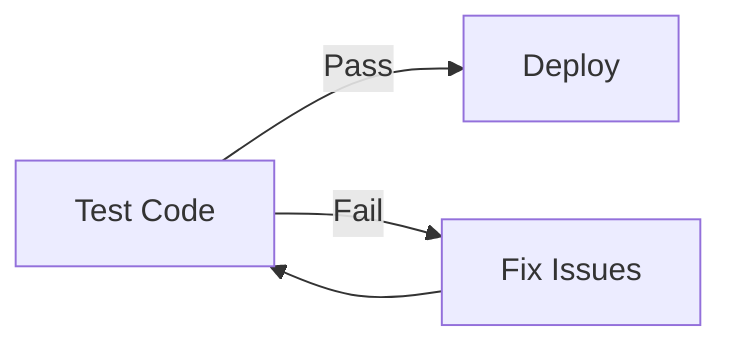

# Planner

The Planner decomposes high-level goals into ordered sequences of executable actions. It handles task dependencies, parallel execution, error recovery, and progress tracking.

## Planning Pipeline



## Task Model

```rust
pub struct Plan {
    pub id: Uuid,
    pub goal: String,
    pub tasks: Vec<Task>,
    pub dependencies: Vec<(TaskId, TaskId)>,
    pub status: PlanStatus,
    pub created: DateTime<Utc>,
    pub deadline: Option<DateTime<Utc>>,
    pub priority: Priority,
}

pub struct Task {
    pub id: TaskId,
    pub description: String,
    pub action: Box<dyn Executable>,
    pub expected_duration: Duration,
    pub retry_count: u32,
    pub max_retries: u32,
    pub timeout: Duration,
    pub status: TaskStatus,
}

pub enum TaskStatus {
    Pending,
    Running,
    Completed(Outcome),
    Failed(Error),
    Skipped,
    Blocked,
}
```

## Execution Strategies

### Sequential Execution

Tasks are executed one after another:


### Parallel Execution

Independent tasks run concurrently:



### Conditional Branching



## Error Recovery

```rust
pub enum RecoveryStrategy {
    Retry(u32),                  // Retry N times
    Skip,                        // Skip and continue
    Alternative(Box<dyn Executable>), // Use fallback
    Rollback,                    // Undo all changes
    Abort,                       // Stop entire plan
    AskUser,                     // Request guidance
}
```

## Configuration

```toml
[planner]
max_concurrent_tasks = 4
default_timeout_sec = 300
max_retries = 3
enable_recovery = true
ask_user_on_failure = true
plan_output_path = "/var/log/prometheus/plans"
```

## Next Steps

- [Reasoning Engine](reasoning.md) — How plans are derived
- [Automation Engine](automation.md) — Learned workflow execution
- [Plugin System](plugins.md) — Extending planner capabilities
