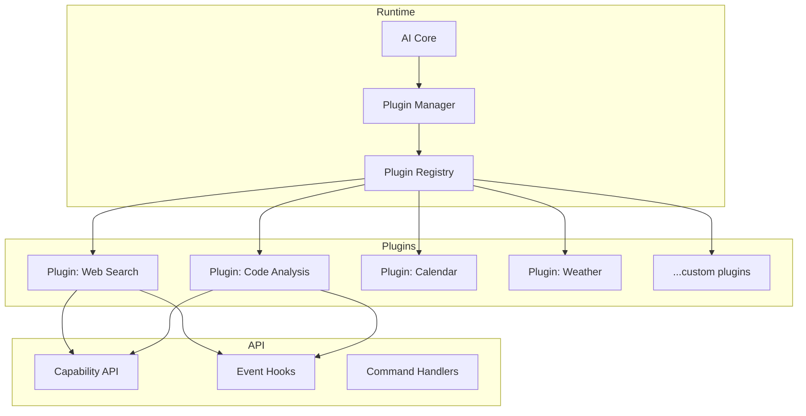
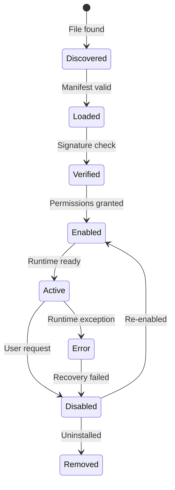

# AI Plugin System

The AI Core supports dynamic plugin loading to extend capabilities at runtime. Plugins can add new reasoning strategies, data sources, tool integrations, and models.

## Plugin Architecture



## Plugin Manifest

```toml
[plugin]
name = "web-search"
version = "1.0.0"
author = "Prometheus OS Team"
description = "Web search capability for the AI Core"
api_version = "0.1.0"

[capabilities]
provides = ["search.web"]
requires = ["network.http"]
events = ["search.performed"]

[permissions]
network = true
filesystem = false
system = false
user_data = false
```

## Plugin Lifecycle



## Permissions Model

| Permission | Description | Risk |
|-----------|-------------|------|
| `network.http` | Make HTTP requests | Medium |
| `network.listen` | Open network servers | High |
| `filesystem.read` | Read file contents | Medium |
| `filesystem.write` | Write/modify files | High |
| `system.command` | Execute shell commands | Critical |
| `user_data` | Access user information | High |
| `ai.memory` | Read/write AI memory | Medium |
| `ai.reasoning` | Intercept reasoning chain | High |

## Next Steps

- [Plugin Development Guide](../plugins/development.md)
- [Plugin API Reference](../api/plugin-api.md)
- [Plugin Marketplace](../plugins/marketplace.md)
