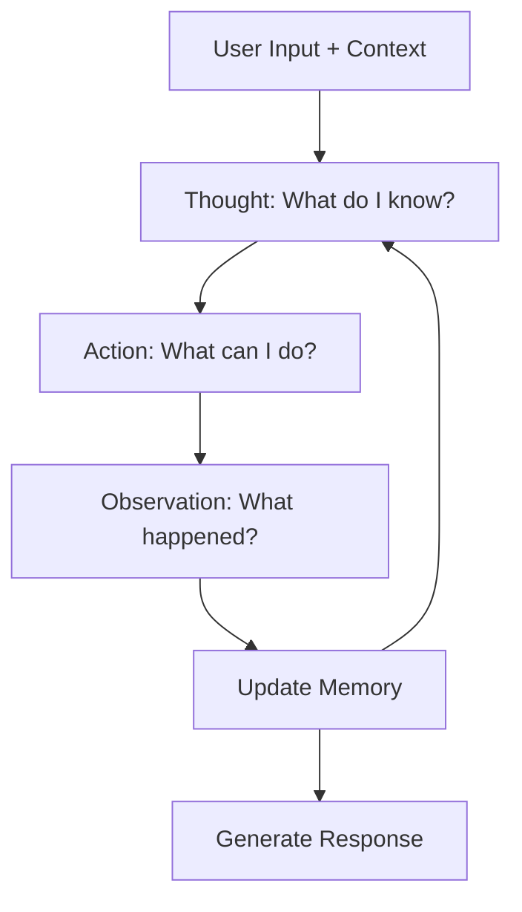
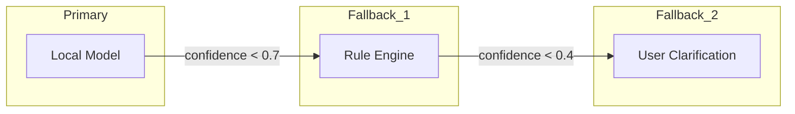

# Reasoning Engine

The Reasoning Engine implements a structured ReAct (Reasoning + Acting) loop that decomposes user intent into verifiable steps, executes actions, observes outcomes, and refines its understanding.

## ReAct Loop



## Implementation

The reasoning pipeline is implemented in `ai-core/src/reasoning.rs`:

```rust
pub enum ReasoningStep {
    Analyze(String),             // Understand the problem
    Retrieve(String),            // Get context from memory
    Decompose(String),           // Break into sub-tasks
    Execute(String),             // Perform an action
    Observe(String),             // Collect results
    Synthesize(String),          // Combine observations
    Conclude(String, f64),       // Final answer with confidence
}

pub struct ReasoningChain {
    steps: Vec<ReasoningStep>,
    context: ContextState,
    confidence: f32,
    duration: Duration,
}
```

## Reasoning Strategies

### Direct Command

Lowest latency path for unambiguous commands:

```
Input: "Open terminal"
Thought: User wants terminal application
Action: launch_application("terminal")
Observation: Terminal opened successfully
Response: "Terminal opened"
```

### Query Resolution

For questions requiring system state:

```
Input: "How much RAM do I have?"
Thought: Need to query system memory
Action: query_system("memory")
Observation: MemTotal=16GB, MemAvailable=11.2GB
Response: "You have 16 GB total, 11.2 GB available"
```

### Multi-Step Task

Complex tasks requiring decomposition:

```
Input: "Set up a web dev environment"
Thought: This requires multiple steps
Decompose: install node → create project → open editor
Action 1: install_package("nodejs")
Observation: Node.js installed
Action 2: create_directory("~/projects/web-app")
Observation: Directory created
Action 3: launch_application("code", "~/projects/web-app")
Observation: VS Code opened
Response: "Web dev environment ready with Node.js"
```

### Ambiguous Resolution

Handles underspecified requests:

```
Input: "Make it faster"
Thought: What does "it" refer to? 
Retrieve: Active context → user is compiling code
Action: suggest_optimization("compiler flags", "-O2 -march=native")
Response: "I can optimize your build with -O2 flags. Apply?"
```

## Confidence Scoring

Each conclusion includes a confidence score (0.0–1.0):

```rust
pub struct Confidence {
    pub score: f32,
    pub factors: Vec<ConfidenceFactor>,
}

pub enum ConfidenceFactor {
    DirectMatch(f32),        // Exact command match
    ContextualRelevance(f32), // How well context supports this
    HistoricalAccuracy(f32),  // Past success rate for similar queries
    Uncertainty(f32),        // Information incompleteness
}
```

## Fallback Chain

When confidence is low, the engine escalates:



## Configuration

```toml
[reasoning]
max_iterations = 10
confidence_threshold = 0.6
enable_fallback = true
fallback_model = "rule-engine"
timeout_ms = 5000
```

## Next Steps

- [Memory System](memory.md) — How context is stored and retrieved
- [Knowledge Graph](graph.md) — Entity relationship management
- [Planner](planner.md) — Multi-step task planning
