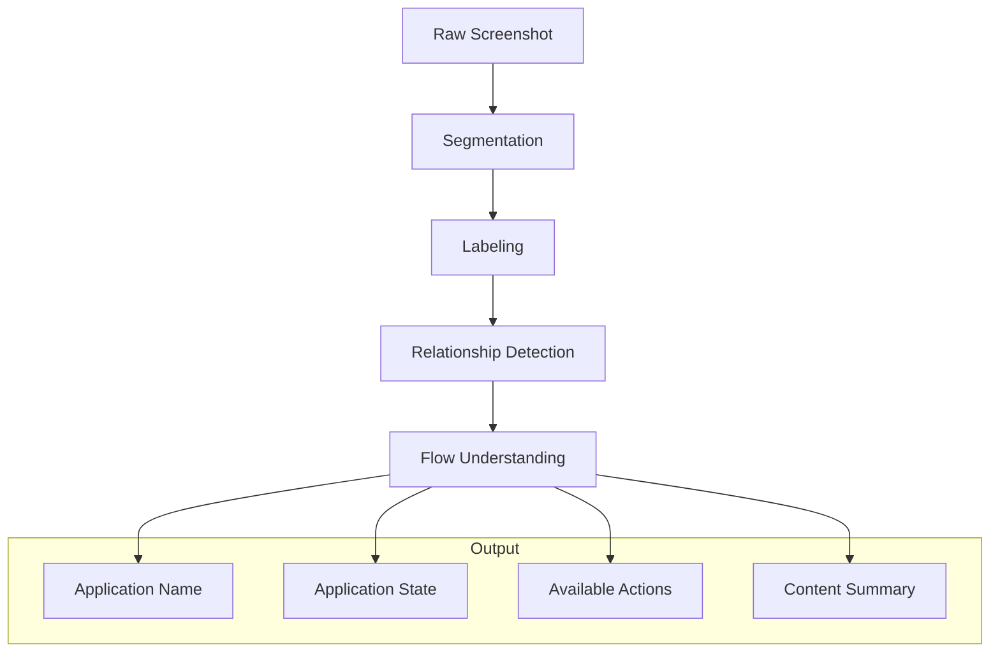

# Vision Engine

The Vision Engine provides real-time screen understanding capabilities — detecting UI elements, reading text, identifying applications, and understanding visual context.

## Pipeline

```mermaid
graph LR
    subgraph Capture
        SCR[Screen Capture]
        SEL[Region Select]
        FPS[Frame Throttle]
    end
    subgraph Process
        OCR[OCR Engine]
        DET[Element Detection]
        CLS[Classification]
    end
    subgraph Understand
        LAY[Layout Analysis]
        SEM[Semantic Labeling]
        CTX[Context Building]
    end
    subgraph Output
        JSON[JSON Structure]
        TEXT[Extracted Text]
        MAP[Interactive Map]
    end

    Capture --> Process
    Process --> Understand
    Understand --> Output
```



## Capabilities

### OCR (Optical Character Recognition)

Extracts text from any on-screen region:

```rust
pub struct OCRExtract {
    pub text: String,
    pub confidence: f32,
    pub bounding_boxes: Vec<BoundingBox>,
    pub lines: Vec<TextLine>,
}

pub struct TextLine {
    pub text: String,
    pub font_size: f32,
    pub font_family: Option<String>,
    pub color: Color,
    pub rect: BoundingBox,
}
```

### UI Element Detection

Identifies interactive elements on screen:

| Element Type | Properties Detected |
|-------------|-------------------|
| Button | Label, state (pressed/hover), bounds |
| Text Field | Content, placeholder, focus state |
| Dropdown | Selected item, options, expanded |
| Checkbox | Checked state, label |
| Scrollbar | Position, extent, visible range |
| Window | Title, bounds, focused, minimized |

### Context Analysis



## Performance

| Operation | Latency | Notes |
|-----------|---------|-------|
| Screen capture | < 2 ms | DRM/KMS direct |
| OCR (full screen) | < 50 ms | Tesseract optimized |
| Element detection | < 30 ms | Lightweight CNN |
| Full context build | < 100 ms | Combined pipeline |
| Capture FPS | configurable | Default: 5 FPS |

## Integration

```rust
// Example: Understanding the active window
let vision = ai_core::VisionEngine::new(&config);
let screenshot = vision.capture_active_window()?;
let elements = vision.detect_elements(&screenshot)?;
let text = vision.extract_text(&screenshot)?;
let context = vision.analyze_context(&screenshot)?;

println!("Window: {}", context.application_name);
println!("Elements: {} detected", elements.len());
println!("Text: {}", text);
```

## Next Steps

- [Voice Engine](voice.md) — Speech recognition and synthesis
- [Automation Engine](automation.md) — Combining vision with action
- [AI Core Configuration](config.md)
