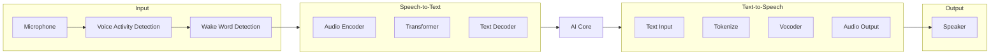
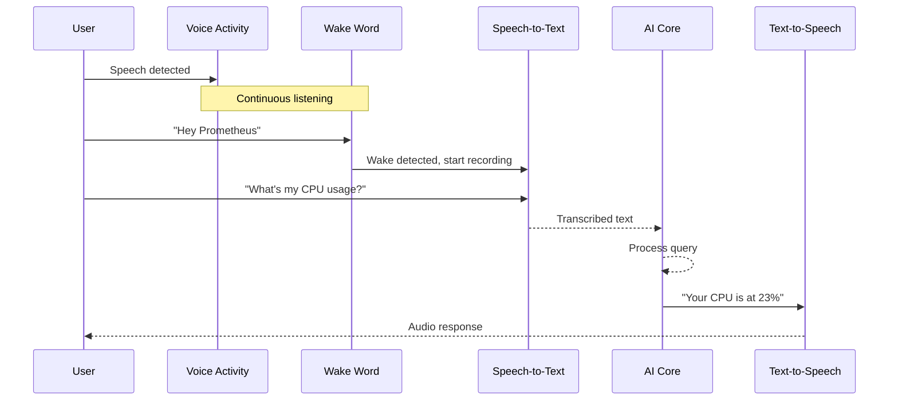

# Voice Engine

The Voice Engine provides bidirectional speech interaction — wake-word detection, speech-to-text transcription, and text-to-speech synthesis.

## Pipeline



## Wake Word Detection

```rust
pub struct WakeWordConfig {
    pub wake_word: String,           // "prometheus"
    pub model_path: PathBuf,         // Path to wake word model
    pub sensitivity: f32,            // 0.0 - 1.0
    pub threshold: f32,              // Detection confidence (default: 0.7)
    pub timeout_ms: u64,             // Listen duration after wake (default: 5000)
}
```

## Speech Recognition

Uses Whisper-based models for transcription:

```rust
pub struct RecognitionResult {
    pub text: String,
    pub confidence: f32,
    pub language: String,
    pub duration_sec: f64,
    pub segments: Vec<Segment>,
}

pub struct Segment {
    pub start: f64,
    pub end: f64,
    pub text: String,
    pub tokens: Vec<u32>,
    pub confidence: f32,
}
```

## Speech Synthesis

```rust
pub struct SynthesisConfig {
    pub voice: String,               // Voice model identifier
    pub speed: f32,                  // 0.5 - 2.0
    pub pitch: f32,                  // 0.5 - 2.0
    pub volume: f32,                 // 0.0 - 1.0
    pub sample_rate: u32,            // 24000
    pub format: AudioFormat,         // WAV, MP3, Opus
}
```

## Audio Pipeline



## Configuration

```toml
[voice]
enabled = true
wake_word = "prometheus"
input_device = "default"
output_device = "default"

[voice.wake_word]
model = "porcupine"
sensitivity = 0.7
threshold = 0.5

[voice.stt]
model = "whisper-base"
language = "en"
beam_size = 5
compute_type = "int8"

[voice.tts]
engine = "piper"
voice = "en_US-amy-medium"
speed = 1.0
pitch = 1.0
```

## Next Steps

- [Vision Engine](vision.md) — Screen understanding
- [Automation Engine](automation.md) — Voice-triggered workflows
- [AI Core Configuration](config.md)
