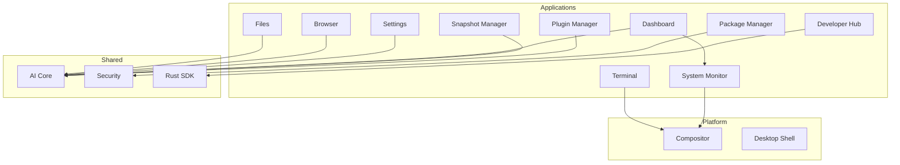

# Applications

Prometheus OS ships with 10 native Rust applications, all sharing a consistent design language and deep AI integration.

## Application Overview

| Application | Crate | Purpose | CLI Binary |
|------------|-------|---------|------------|
| Terminal | `prometheus-terminal` | GPU-accelerated terminal emulator | `prometheus-terminal` |
| Files | `prometheus-files` | AI-assisted file manager | `prometheus-files` |
| Browser | `prometheus-browser` | Web engine with AI analysis | `prometheus-browser` |
| Settings | `prometheus-settings` | System configuration (8 modules) | `prometheus-settings` |
| Dashboard | `prometheus-dashboard` | AI command center, live monitoring | `prometheus-dashboard` |
| Package Manager | `prometheus-package-manager` | pacman + AUR + Flatpak interface | `prometheus-package-manager` |
| System Monitor | `prometheus-system-monitor` | Color-coded resource monitor | `prometheus-system-monitor` |
| Snapshot Manager | `prometheus-snapshot-manager` | Btrfs snapshot management | `prometheus-snapshot-manager` |
| Plugin Manager | `prometheus-plugin-manager` | Runtime plugin loading | `prometheus-plugin-manager` |
| Developer Hub | `prometheus-developer-hub` | SDK docs & API browser | `prometheus-developer-hub` |

## Architecture



## Dashboard

The **AI Command Center** is the primary interface for system monitoring and AI interaction:

```bash
# Launch the dashboard
prometheus-dashboard
```

Features:
- Real-time CPU usage per-core with frequency and temperature
- Memory utilization with swap tracking
- GPU monitoring (AMD, Intel, NVIDIA via nvidia-smi)
- Disk I/O and partition usage
- Network throughput per interface
- Top processes by memory/CPU
- AI agent activity and memory graph status
- Auto-refresh every 1 second

## Package Manager

Unified interface for all package sources:

```bash
# Search across pacman, AUR, and Flatpak
prometheus-package-manager search "firefox"

# Install a package
prometheus-package-manager install firefox

# Show available updates
prometheus-package-manager update

# Full system upgrade
prometheus-package-manager upgrade

# List installed packages
prometheus-package-manager list
```

## Settings

8-module configuration center:

```bash
# Show display settings
prometheus-settings display show

# Enable AI configuration
prometheus-settings ai enable

# Network configuration
prometheus-settings network show
```

## Next Steps

- [Dashboard Architecture](architecture/dashboard.md)
- [Package Manager Development](developer/package-manager.md)
- [Building Applications](tutorials/build-app.md)
