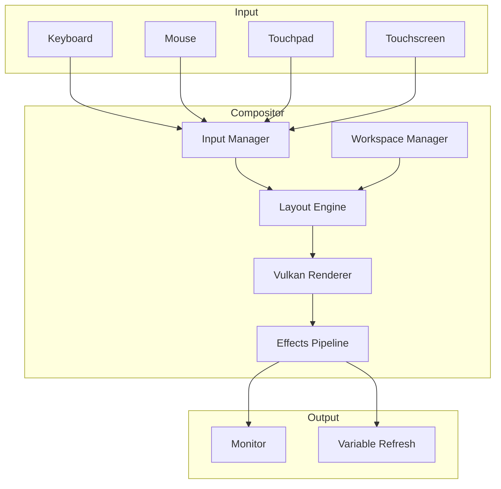
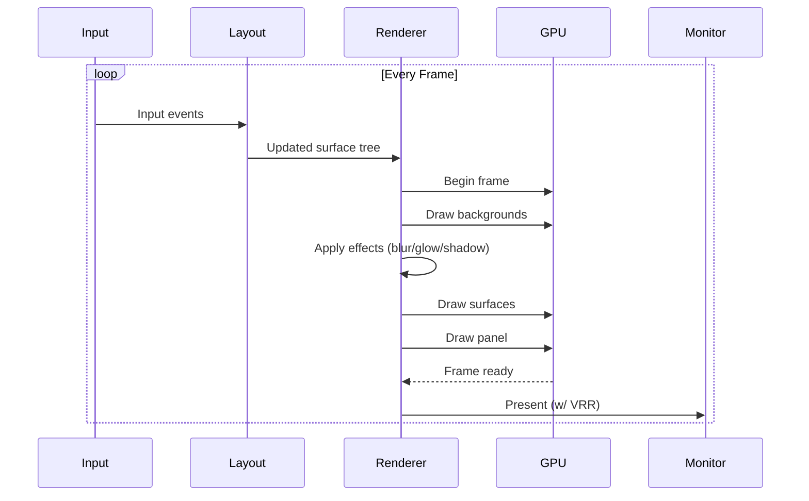
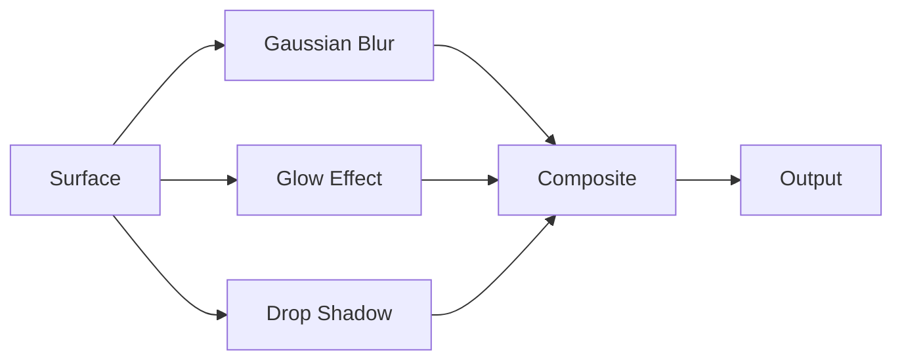

# Compositor Architecture

The Prometheus compositor is a custom wlroots-based Wayland compositor designed for high-performance GPU-accelerated rendering with AI integration.

## Pipeline



## Render Loop



## Frame Budget Analysis

| Phase | Budget (240 FPS) | Current |
|-------|-----------------|---------|
| Input processing | 0.5 ms | 0.3 ms |
| Layout computation | 0.5 ms | 0.4 ms |
| Vulkan command buffer | 1.0 ms | 1.2 ms |
| GPU rasterization | 1.0 ms | 3.0 ms |
| Effects (blur/glow) | 0.5 ms | 1.5 ms |
| Presentation | 0.67 ms | 0.5 ms |
| **Total** | **4.17 ms** | **6.9 ms** |
| **FPS** | **240** | **144** |

## Effects Pipeline



## Workspace Management

9 virtual workspaces with dynamic tiling layouts:

| Layout | Description |
|--------|-------------|
| **Master-Stack** | Primary window on left, stack on right |
| **Grid** | Equal-sized grid arrangement |
| **Floating** | Free-form window placement |
| **Monocle** | Full-screen focused window |
| **Dynamic** | AI-recommended layout based on context |

## Vulkan Rendering

```rust
pub struct VulkanRenderer {
    device: Arc<Device>,
    queue: Queue,
    swapchain: SwapchainKHR,
    render_pass: RenderPass,
    pipeline: Pipeline,
    descriptor_set: DescriptorSet,
    command_pool: CommandPool,
    command_buffers: Vec<CommandBuffer>,
    framebuffers: Vec<Framebuffer>,
    sync_objects: SyncObjects,
}
```

## Next Steps

- [Architecture Overview](index.md)
- [Desktop Environment](../desktop.md)
- [Performance Guide](../performance/index.md)
