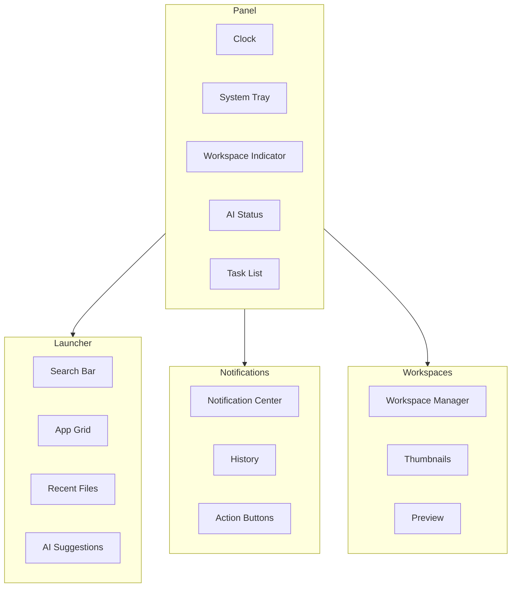

# Desktop Environment Architecture

The Prometheus desktop shell provides the user interface layer — panel, launcher, notification center, and workspace management.

## Shell Components



## Panel Layout

```
┌──────────────────────────────────────────────────────────────────────┐
│  Apps  │  Workspaces  │           Title              │  AI  │  Tray  │
│  Menu  │  1  2  3  4   │     Active Window           │  ●   │  🔊🔋🕐 │
└──────────────────────────────────────────────────────────────────────┘
```

## AI Integration Points

| Component | AI Feature |
|-----------|------------|
| Panel indicator | AI status, quick query |
| Search/Launcher | AI-powered suggestions |
| Notification center | AI-generated summaries |
| Smart workspaces | AI-arranged layout per task |
| Autocomplete | AI-predicted next action |

## Next Steps

- [Compositor Architecture](compositor.md)
- [Desktop Overview](../desktop.md)
- [Configuration](../reference/configuration.md)
