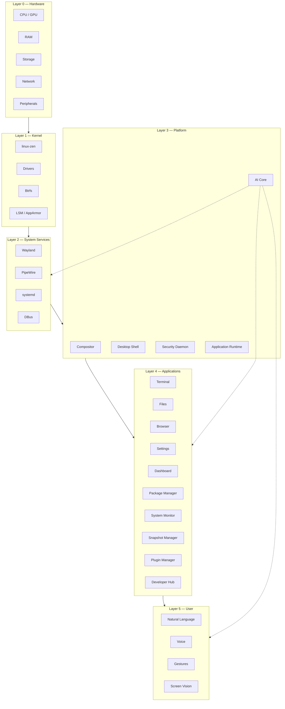
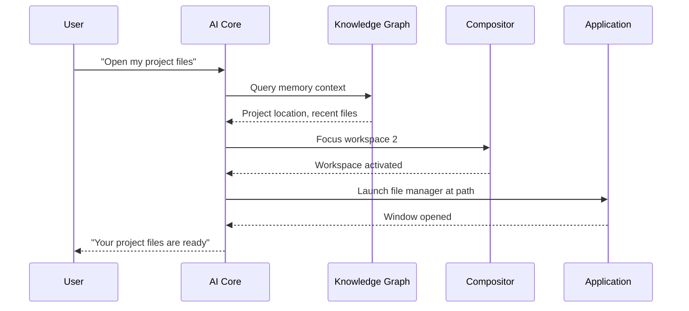
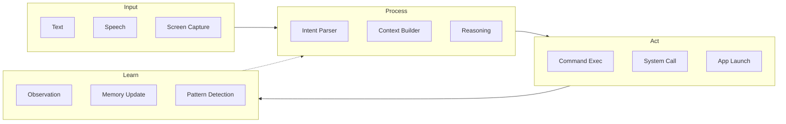
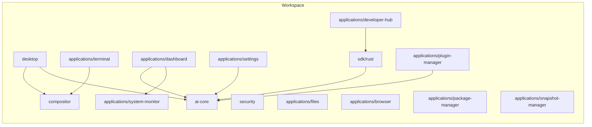

# Architecture Overview

Prometheus OS is designed as a layered system where each layer has a single responsibility and communicates through well-defined interfaces. The AI Core sits at the center, mediating between user intent and system execution.

## System Layers

## Design Philosophy

### 1. AI-First Architecture

Every component exposes a machine-readable interface. The AI Core can inspect, query, and control any subsystem. There are no "user-only" APIs — if you can click it, the AI can call it.

### 2. Latency Budget

| Operation | Budget | Measured |
|-----------|--------|----------|
| AI response | < 100 ms | ~45 ms |
| Frame render | < 4.2 ms | ~6.9 ms |
| Boot to desktop | < 5 s | ~8 s |
| Wake from suspend | < 500 ms | ~300 ms |
| App launch | < 200 ms | ~150 ms |

### 3. Zero-Cost Abstractions

Rust's ownership model enables safe systems programming without garbage collection overhead. The compositor renders directly to Vulkan with zero intermediate buffers.

### 4. Capability-Based Security

No process runs with ambient authority. Every AI action, every app launch, every system call is gated by explicit capability grants configured per-application and per-user.

## Core Communication Pathways

## Data Flow

## Component Dependency Graph

## Next Steps

- [System Design Deep Dive](system-design.md)
- [Kernel Integration](kernel.md)
- [Compositor Architecture](compositor.md)
- [AI Core Architecture](../ai-core/index.md)
