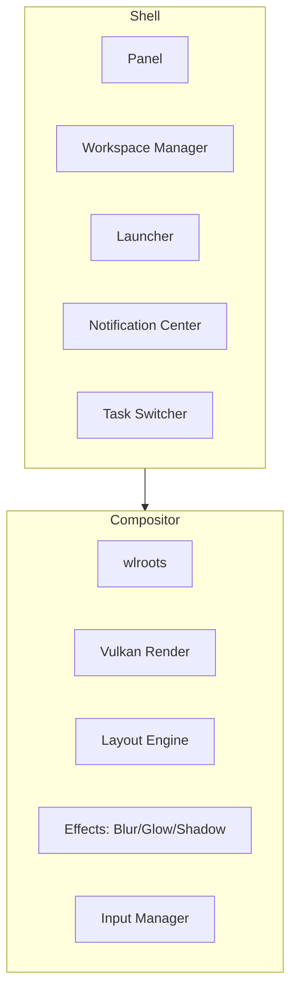
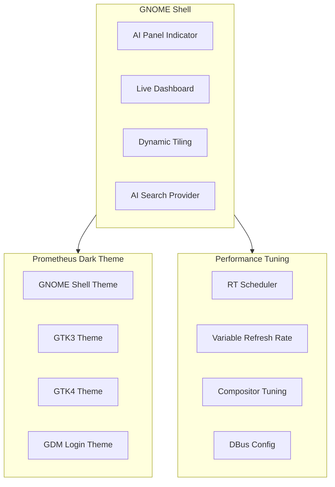

# Desktop Environments

Prometheus OS provides two desktop experiences: the native Prometheus compositor for maximum performance, and a fully integrated GNOME session for familiarity.

## Prometheus Native

| Feature | Status |
|---------|--------|
| wlroots-based compositor | ✅ |
| Vulkan 1.3 rendering | ✅ |
| GPU-accelerated blur/glow/shadow | ✅ |
| 9 virtual workspaces | ✅ |
| Dynamic tiling (master-stack, grid, float) | ✅ |
| 240 FPS target | ✅ |
| Physics-based animations | 🔄 In Progress |
| Multi-monitor with VRR | 🔄 In Progress |

## GNOME Integration

### Extensions

| Extension | Function |
|-----------|----------|
| **Prometheus AI** | AI indicator in the top bar, quick query dialog, screen analysis |
| **Prometheus Dashboard** | Real-time CPU/GPU/RAM/disk monitor in the panel |
| **Prometheus Layout** | Dynamic window tiling (master-stack, grid, floating modes) |

### Theme Features

- Dark glassmorphism design language
- Blur effects on panels and menus
- Electric blue accent (#0078FF)
- Consistent with native Prometheus shell
- Supports both light and dark variants
- Optimized for high-DPI displays

## Comparison

| Feature | Prometheus Native | GNOME Session |
|---------|------------------|---------------|
| Compositor | Custom wlroots | Mutter |
| Max FPS | 240 | 144 (tuned) |
| RAM usage | ~800 MB | ~1.2 GB |
| AI integration | Native | Extension-based |
| App support | Wayland-native | Wayland + XWayland |
| Setup complexity | Minimal | Requires GNOME |

## Next Steps

- [Compositor Architecture](architecture/compositor.md)
- [Configuration](reference/configuration.md)
- [Keyboard Shortcuts](reference/shortcuts.md)
