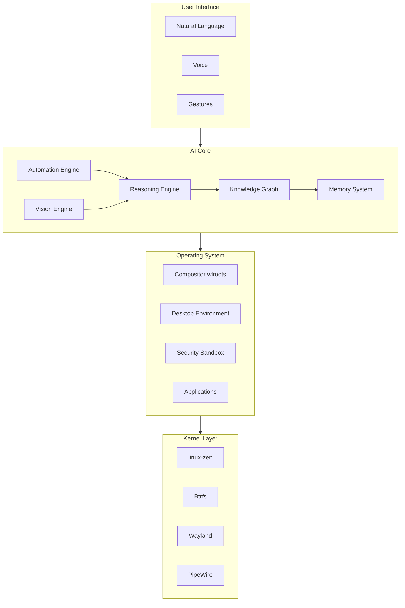

# Prometheus OS

<div class="hero-title">The OS is the AI</div>

<div class="hero-subtitle">
An AI-native operating system architected from the kernel up — the AI is not an application running on the OS, it <em>is</em> the OS. Every subsystem from the compositor to the memory manager is designed for zero-latency human-AI interaction.
</div>

<div class="quick-links">
  <a href="quickstart/">Quick Start</a>
  <a href="architecture/">Architecture</a>
  <a href="ai-core/">AI Core</a>
  <a href="sdk/">SDK</a>
  <a href="https://github.com/Dev-serpent/prometheus-os">GitHub</a>
  <a href="changelog/">Changelog</a>
</div>

---

## By the Numbers

<div class="stat-grid">
  <div class="stat-card">
    <span class="stat-number">15</span>
    <span class="stat-label">Rust Crates</span>
  </div>
  <div class="stat-card">
    <span class="stat-number">140+</span>
    <span class="stat-label">Source Files</span>
  </div>
  <div class="stat-card">
    <span class="stat-number">9.8K</span>
    <span class="stat-label">Lines of Code</span>
  </div>
  <div class="stat-card">
    <span class="stat-number">240</span>
    <span class="stat-label">FPS Target</span>
  </div>
  <div class="stat-card">
    <span class="stat-number">&lt;900</span>
    <span class="stat-label">MB Idle RAM</span>
  </div>
  <div class="stat-card">
    <span class="stat-number">&lt;100</span>
    <span class="stat-label">ms AI Response</span>
  </div>
</div>

## Architecture at a Glance



## Core Principles

<div class="feature-grid">
  <div class="feature-card">
    <h3>AI Native</h3>
    <p>The AI is not a feature — it is the operating environment. Every hardware and software decision prioritizes AI response latency and context awareness.</p>
  </div>
  <div class="feature-card">
    <h3>Zero Overhead</h3>
    <p>Written in Rust with no runtime, no garbage collector, no unnecessary abstractions. The compositor targets 240 FPS with Vulkan 1.3.</p>
  </div>
  <div class="feature-card">
    <h3>Self-Learning</h3>
    <p>A persistent semantic memory graph continuously learns user behavior, detects patterns, and autonomizes repetitive workflows.</p>
  </div>
  <div class="feature-card">
    <h3>Privacy First</h3>
    <p>Mandatory sandboxing, memory encryption, permission-gated AI actions, and cryptographic audit trails. Your data stays yours.</p>
  </div>
  <div class="feature-card">
    <h3>Universal Runtime</h3>
    <p>Runs Linux binaries, Flatpaks, and AUR packages through an intelligent sandbox translation layer with zero configuration.</p>
  </div>
  <div class="feature-card">
    <h3>Developer Platform</h3>
    <p>SDK bindings for Rust, Python, C++, and JavaScript. Plugin system with hot-reload. Robotics API for ROS2, Arduino, and ESP32.</p>
  </div>
</div>

## Technology Stack

| Layer        | Technology |
|-------------|------------|
| **Kernel**      | linux-zen, systemd, Btrfs, Wayland, PipeWire |
| **AI Core**     | Rust, DashMap, ReAct, ONNX Runtime, Whisper |
| **Compositor**  | wlroots, Vulkan 1.3, libinput, xkbcommon |
| **Desktop**     | Custom shell + GNOME integration |
| **Security**    | bubblewrap, Landlock LSM, AES-256-GCM, sbctl |
| **SDK**         | Rust, Python, C++, JavaScript bindings |
| **Robotics**    | ROS2, CAN bus, serial, GPIO |

## Desktop Environments

<div class="grid-cards">
  <div class="card">
    <div class="card-title">Prometheus Native</div>
    <p>Custom wlroots compositor with GPU scheduling, dynamic tiling, physics animations, blur/glow/shadow effects, and 9 virtual workspaces.</p>
  </div>
  <div class="card">
    <div class="card-title">GNOME Session</div>
    <p>Full dark glassmorphism theme, 3 AI-integrated Shell extensions, custom GDM login, 240 Hz Mutter tuning with real-time scheduling.</p>
  </div>
</div>

## Quick Start

```bash
git clone https://github.com/Dev-serpent/prometheus-os.git
cd prometheus-os
make all          # Build 15 Rust crates
make gnome        # Build GNOME integration
make install      # Install to /usr
make iso          # Build bootable ISO
```

---

## Roadmap

| Phase | Focus | Status |
|-------|-------|--------|
| Alpha | Core scaffolding, compositor, AI engine stubs | ✅ Complete |
| Beta  | Working compositor, real AI inference, functional apps | 🔄 In Progress |
| RC    | Performance tuning, security audit, robust plugin system | 📅 2026 Q4 |
| 1.0   | Production release, hardware certification, community SDK | 📅 2027 Q1 |

---

<div align="center">
  <p><strong>Prometheus OS</strong> — <em>Built with Rust</em></p>
  <p>
    <a href="https://github.com/Dev-serpent/prometheus-os">GitHub</a> ·
    <a href="https://discord.gg/prometheus-os">Discord</a> ·
    <a href="https://x.com/prometheus_os">X / Twitter</a>
  </p>
</div>
