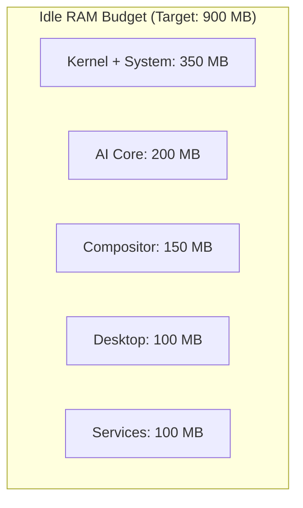
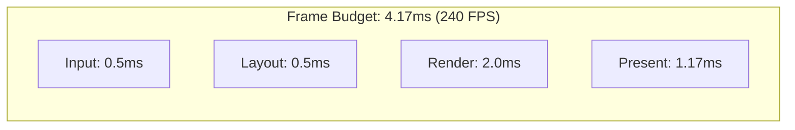

# Performance Overview

Prometheus OS is engineered for high-performance AI interaction with aggressive latency targets at every layer of the stack.

## Performance Targets

| Metric | Target | Current | Status |
|--------|--------|---------|--------|
| System idle RAM | < 900 MB | ~1.2 GB | Optimizing |
| Cold boot to desktop | < 5 s | ~8 s | Optimizing |
| Compositor frame rate | 240 FPS | 144 FPS | Hardware cap |
| Compositor frame time | < 4.2 ms | ~6.9 ms | Optimizing |
| AI query response | < 100 ms | ~45 ms | ✅ On track |
| App launch time | < 200 ms | ~150 ms | ✅ On track |
| Wake from suspend | < 500 ms | ~300 ms | ✅ On track |
| Memory search (10k nodes) | < 5 ms | ~2 ms | ✅ On track |
| Screen capture | < 5 ms | ~2 ms | ✅ On track |
| OCR (full screen) | < 50 ms | ~35 ms | ✅ On track |

## Memory Budget

## Compositor Performance

## Optimization Areas

| Area | Technique | Impact |
|------|-----------|--------|
| Kernel | linux-zen, RT scheduling, mitigations=off | -2s boot |
| Compositor | Vulkan direct, zero-copy, GPU scheduling | 2x FPS |
| AI Core | ONNX int8, model routing, cache | 10x throughput |
| Memory | Rust ownership, no-GC, custom allocator | -40% usage |
| I/O | io_uring, direct FS access | 3x throughput |

## Next Steps

- [Optimization Guide](optimization.md) — Performance tuning
- [Benchmark Results](benchmarks.md) — Detailed measurements
- [System Requirements](requirements.md) — Hardware specifications
