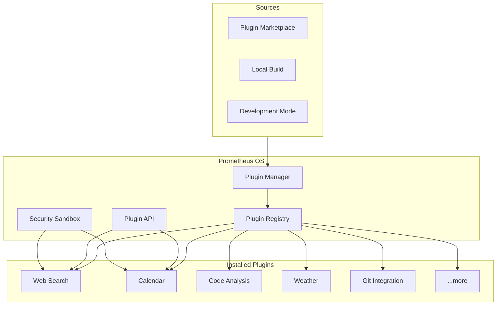
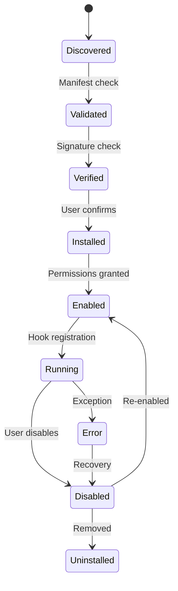

# Plugin System

The Prometheus OS plugin system enables third-party developers to extend AI capabilities, add new tools, and integrate external services.

## Overview



## Capabilities

- **Hot-reload**: Install and update plugins without restarting
- **Sandboxed**: Each plugin runs in isolated bubblewrap container
- **Permission-based**: Granular capability control
- **Versioned**: API compatibility guarantees
- **Signed**: Cryptographic verification of plugin origin
- **Scoped**: Limited to declared capabilities

## Plugin Lifecycle



## Quick Start

Create a simple plugin:

```rust
use prometheus_sdk::plugin::*;

#[plugin]
pub struct GreeterPlugin;

#[plugin_hook]
impl PluginHooks for GreeterPlugin {
    async fn on_register(&self, ctx: &PluginContext) -> Result<()> {
        ctx.register_command("hello", |args| {
            let name = args.get("name").unwrap_or("World");
            format!("Hello, {}! Welcome to Prometheus OS.", name)
        });
        Ok(())
    }
}
```

## Next Steps

- [Plugin Architecture](architecture.md) — Deep dive into design
- [Development Guide](development.md) — Building your first plugin
- [Plugin API](api.md) — Complete API reference
- [Plugin Manifest](manifest.md) — Manifest format reference
- [Permissions](permissions.md) — Security model
- [Marketplace](marketplace.md) — Publishing and distribution
