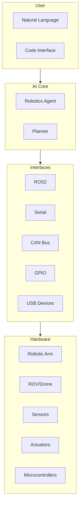

# Robotics Integration

Prometheus OS provides first-class robotics support with direct hardware interfaces and ROS2 integration. The AI Core can control robotic systems through natural language commands.

## Architecture



## Supported Platforms

| Platform | Status | Interface |
|----------|--------|-----------|
| ROS2 (Humble/Iron/Rolling) | ✅ | Native Rust binding |
| Arduino | ✅ | Serial protocol |
| ESP32 | ✅ | Serial + WiFi |
| CAN bus devices | ✅ | SocketCAN |
| GPIO (sysfs/libgpiod) | ✅ | Direct I/O |
| USB serial devices | ✅ | ttyACM/ttyUSB |
| I2C/SPI devices | 🔄 | In development |
| LiDAR (RPLIDAR, YDLIDAR) | 🔄 | In development |
| Depth cameras (Intel RealSense) | 🔄 | In development |

## Example: Natural Language Robot Control

```python
from prometheus_sdk import PrometheusSDK
import asyncio

async def main():
    prom = await PrometheusSDK.create()
    
    # Control a robotic arm through natural language
    await prom.ai.query("Move the arm to position x=150, y=200, z=50")
    
    # Execute a pick-and-place sequence
    await prom.ai.query("Pick up the object at position A and place it at B")
    
    # Monitor sensor data
    response = await prom.ai.query("What are the current joint angles?")
    print(f"Joint angles: {response}")

asyncio.run(main())
```

## Next Steps

- [ROS2 Integration](ros2.md) — Full robotics middleware
- [Serial Communication](serial.md) — Serial port interface
- [GPIO Interface](gpio.md) — General-purpose I/O
- [Arduino Support](arduino.md) — Microcontroller programming
- [ESP32 Support](esp32.md) — WiFi-enabled devices
- [CAN Bus](canbus.md) — Vehicle/industrial communication
