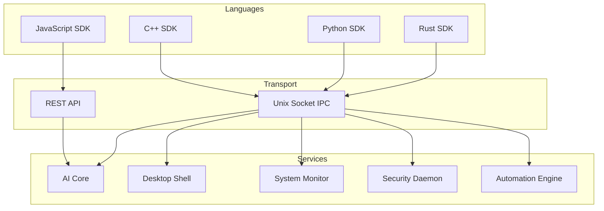

# SDK Overview

The Prometheus OS SDK provides programmatic access to AI capabilities, desktop operations, system information, and automation features. Available in Rust, Python, C++, and JavaScript.

## Architecture



## SDK Modules

| Module | Rust | Python | C++ | JS | Description |
|--------|------|--------|-----|----|-------------|
| AI | ✅ | ✅ | ✅ | ✅ | Query AI core, manage agents |
| Desktop | ✅ | ✅ | ✅ | ✅ | Windows, workspaces, apps |
| System | ✅ | ✅ | ✅ | ✅ | CPU, RAM, disk, network |
| Security | ✅ | ✅ | ✅ | ✅ | Permissions, audit, sandbox |
| Automation | ✅ | ✅ | ❌ | ❌ | Workflow management |
| Vision | ✅ | ❌ | ❌ | ❌ | Screen capture, OCR |
| Voice | ✅ | ❌ | ❌ | ❌ | Speech I/O |
| Plugins | ✅ | ✅ | ❌ | ✅ | Hot-reload plugins |

## Quick Start Examples

=== "Rust"

    ```rust
    use prometheus_sdk::prelude::*;

    #[tokio::main]
    async fn main() -> Result<()> {
        let prom = PrometheusSDK::new().await?;
        
        // Query the AI
        let response = prom.ai()
            .query("What is my CPU usage?")
            .await?;
        println!("AI: {}", response);

        // Get system info
        let mem = prom.system().memory().await?;
        println!("Memory: {:.1}% used", mem.percent_used);

        Ok(())
    }
    ```

=== "Python"

    ```python
    from prometheus_sdk import PrometheusSDK
    import asyncio

    async def main():
        prom = await PrometheusSDK.create()
        
        # Query the AI
        response = await prom.ai.query("What's on workspace 2?")
        print(f"AI: {response}")
        
        # Get system info
        cpu = await prom.system.cpu()
        print(f"CPU: {cpu.usage_percent:.1f}%")

    asyncio.run(main())
    ```

=== "C++"

    ```cpp
    #include <prometheus/sdk.hpp>
    
    int main() {
        auto prom = prometheus::SDK::create();
        
        // Query the AI
        auto response = prom.ai()->query("Open my project");
        std::cout << "AI: " << response << std::endl;
        
        return 0;
    }
    ```

=== "JavaScript"

    ```javascript
    const { PrometheusSDK } = require('prometheus-sdk');
    
    async function main() {
        const prom = await PrometheusSDK.create();
        
        // Query the AI
        const response = await prom.ai.query('System status');
        console.log(`AI: ${response}`);
    }
    
    main();
    ```

## Installation

=== "Rust"

    ```toml
    [dependencies]
    prometheus-sdk = { git = "https://github.com/Dev-serpent/prometheus-os.git" }
    ```

=== "Python"

    ```bash
    pip install prometheus-sdk
    ```

=== "C++"

    ```bash
    # Include in CMakeLists.txt
    # add_subdirectory(path/to/prometheus-sdk/cpp)
    ```

=== "JavaScript"

    ```bash
    npm install prometheus-sdk
    ```

## Next Steps

- [Rust SDK](rust.md) — Native Rust bindings
- [Python SDK](python.md) — Python bindings
- [C++ SDK](cpp.md) — C++ bindings
- [JavaScript SDK](javascript.md) — JavaScript/TypeScript bindings
- [REST API](../api/rest.md) — HTTP API reference
- [CLI Reference](../reference/cli.md) — Command-line tools
