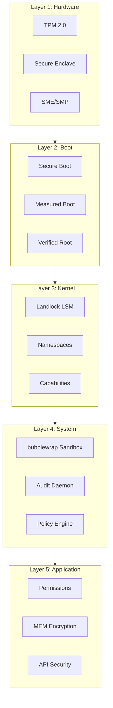
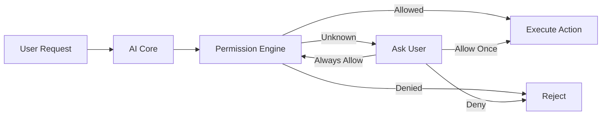
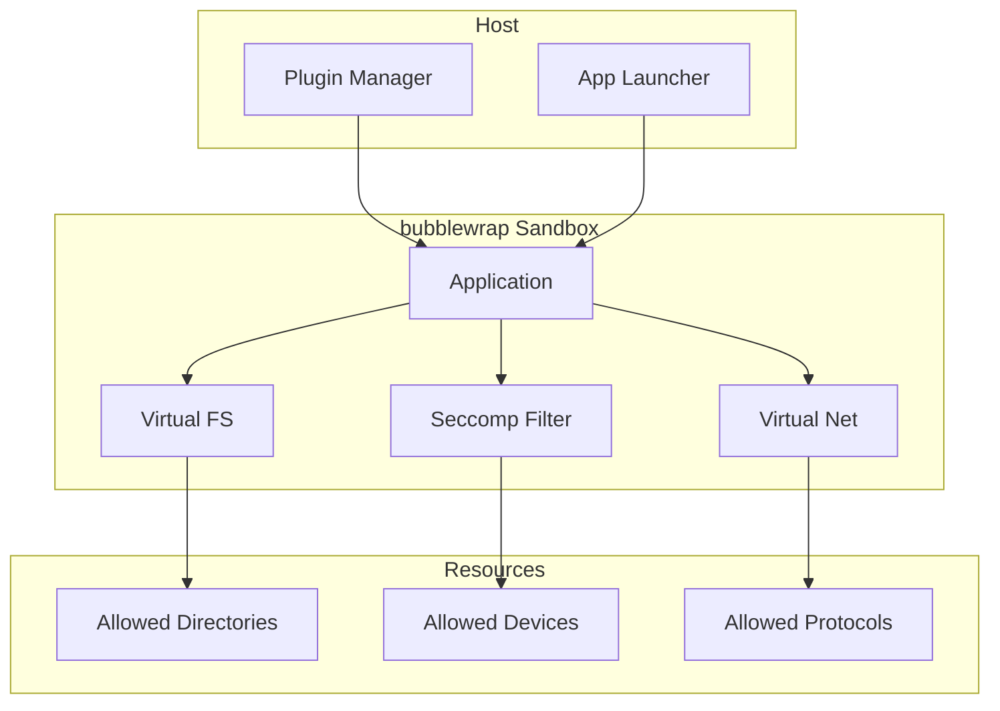

# Security Architecture

Prometheus OS implements a defense-in-depth security model with mandatory sandboxing, capability-based permissions, memory encryption, and cryptographic audit trails.

## Security Layers

## Threat Model

| Threat | Mitigation | Priority |
|--------|-----------|----------|
| Malicious application | Mandatory sandboxing | Critical |
| AI privilege escalation | Permission-gated actions | Critical |
| Memory scraping | Runtime AES-256-GCM | High |
| Boot tampering | Secure Boot + TPM | Critical |
| Unauthorized access | AppArmor + Landlock | High |
| Data exfiltration | Per-process network policy | High |
| Supply chain | Signed packages + plugins | Medium |

## Permission Model

Every AI action must be explicitly authorized:

## Sandbox Architecture

## Security Services

| Service | Function | Implementation |
|---------|----------|---------------|
| Sandbox Manager | Application isolation | bubblewrap + Landlock |
| Permission Engine | Capability-based access control | Custom policy engine |
| Audit Logger | Cryptographic audit trail | Signed append-only log |
| Memory Encryptor | Runtime data protection | AES-256-GCM |
| Secure Boot | Boot chain verification | sbctl + TPM 2.0 |
| Update Verifier | Package signature validation | GPG + SigLevel |

## Next Steps

- [Permission Model](permissions.md) — How permissions work
- [Sandboxing](sandbox.md) — Application isolation
- [Encryption](encryption.md) — Data protection
- [Audit](audit.md) — Logging and forensics
- [Secure Boot](secure-boot.md) — Boot security
- [Privacy](privacy.md) — Data handling and user privacy
